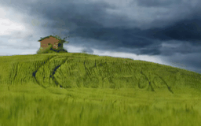

<p align="center">
    
</p>
<div align="center">
    <a href="https://github.com/OpenSparseLLMs/Open-Pandora"></a>
    <a href="https://huggingface.co/Tuyabei/Open-Pandora"></a>
</div>

<h2 align="center"> Open-Pandora: An Open World video generation model</h2>


Based on the [maitrix-org/Pandora](https://github.com/maitrix-org/Pandora) project on GitHub, we have open-sourced the training code and models for the Pandora project. The training process includes two main stages: alignment and finetuning. Additionally, we have released the latest Pandora model weights, which were trained for 60w steps on the [Webvid](https://huggingface.co/datasets/TempoFunk/webvid-10M) dataset.


## Demo
You can control the model in real-time using text, currently supporting 5 rounds of autoregressive prediction to generate 10-second videos. Alternatively, you can generate a single video with the following effects:

### Results with a resolution of <u>320×512</u>.

| **2s 320×512** | **2s 320×512** | **2s 320×512** |
| ---------------------------------------------------------------------------------------------------------------------------------------------------- | ---------------------------------------------------------------------------------------------------------------------------------------------------- | ---------------------------------------------------------------------------------------------------------------------------------------------------- |
|  |  |  |
| Wind flows the leaves. | The red car moves along the path. | Green hills of tuscany, italy, time-lapse. |
|  |  |  |
| The car moves forward. | A bonfire is lit in the middle of a field. | Pouring honey onto some slices of bread. |

### Results with a resolution of <u>576×1024</u>.

| **2s 576×1024** | **2s 576×1024** |
| ---------------------------------------------------------------------------------------------------------------------------------------------------- | ---------------------------------------------------------------------------------------------------------------------------------------------------- | 
|  |  |
| A sailboat sailing in rough seas with a dramatic sunset  | Two young women studying in a library. |
|  |  |
| A brown and white cow eating hay. | A bald eagle flying over a tree filled forest. |
|  |  |
| Two eggs are fried in a frying pan on the stove. | A boat sits on the shore of a lake with mt fuji in the background, camera zooms in. |
## News
- __[2024/09/24]__ 🎉 We have released the first version of the model weights, available on [Hugging Face](https://huggingface.co/Tuyabei/Open-Pandora). This model can be directly used for inference on the original Pandora project.
- __[2024/09/24]__ 🎉 The training code for the alignment and finetuning stages is available.
- __[2024/09/24]__ 🎉 Supports video output at 576×1024 resolution.

## Setup
```shell
conda create -n pandora python=3.11.0 nvidia/label/cuda-12.1.0::cuda-toolkit -y
conda activate pandora
pip install torch torchvision torchaudio
bash build_envs.sh  
```
If your GPU doesn't support CUDA 12.1, you can also install with CUDA 11.8:
```shell
conda create -n pandora python=3.11.0 nvidia/label/cuda-11.8.0::cuda-toolkit -y 
conda activate pandora
pip install torch torchvision torchaudio
bash build_envs.sh  
```

## Inference
### Gradio Demo
1. Download the model checkpoint from [Hugging Face](https://huggingface.co/Tuyabei/Open-Pandora).
2. Run the commands on your terminal
```shell
CUDA_VISIBLE_DEVICES={cuda_id} python gradio_app.py  --ckpt_path {path_to_ckpt}
```

Then you can interact with the model through gradio interface.

## Training Your Own Model

Before training the model, ensure that you have downloaded our model locally. Set `$MODEL_DIR` as the model path and `$HOST_GPU_NUM` as the number of GPUs. Run the following command to align the outputs of the Large Language Model (LLM) and the Text Encoder:

```bash
python3 -m torch.distributed.launch \
    --nproc_per_node=$HOST_GPU_NUM --nnodes=1 --master_addr=127.0.0.1 --master_port=10042 --node_rank=0 \
    trainer.py \
    --model_path $MODEL_DIR \
    --base config/config.yaml \
    --train \
    --do_alignment \
    --logdir output/ckp \
    --devices $HOST_GPU_NUM \
    lightning.trainer.num_nodes=1
```

Then, use the following command to finetune the model to obtain the final version:

```bash
python3 -m torch.distributed.launch \
    --nproc_per_node=$HOST_GPU_NUM --nnodes=1 --master_addr=127.0.0.1 --master_port=10042 --node_rank=0 \
    trainer.py \
    --model_path $MODEL_DIR \
    --base config/config.yaml \
    --train \
    --logdir output/ckp \
    --devices $HOST_GPU_NUM \
    lightning.trainer.num_nodes=1
```

The project is continuously improving, and we look forward to your contributions and participation.


## References

- **Repositories**: [maitrix-org/Pandora](https://github.com/maitrix-org/Pandora) 
- **Related Article**: [Pandora: Towards General World Model with Natural Language Actions and Video States](https://world-model.maitrix.org/assets/pandora.pdf) 
